# Fridge to Food
Created to reduce food waste by turning everyday fridge ingredients into practical meal ideas.
Mobile recipe app based on fridge ingredients, built with React Native (Expo + TypeScript) and Express + Firestore.

## Features
- Firebase Auth login/register
- Recipe search via backend proxy to RapidAPI
- Dietary tag filter (including strict vegetarian post-filter on backend)
- Favorites with offline-first local cache (SQLite) and background sync
- Profile page with avatar upload (camera or photo library)
- Recipe detail long-image sharing
- Local notification on favorite save

## Tech Stack
- Frontend: Expo, React Native, TypeScript
- Navigation: React Navigation (stack + bottom tabs)
- State: Zustand
- Server data: TanStack Query
- Local persistence: expo-sqlite + persisted TanStack cache
- Notifications: expo-notifications
- Secure token storage: expo-secure-store
- Backend: Node.js + Express
- Database/Auth backend: Firebase Admin + Firestore

## Project Structure
- `frontend/`: React Native app
- `backend/`: Express API
- `start.sh`: local startup helper script

## Prerequisites
- Node.js `>=18 <25` (recommended: Node 22 LTS)
- npm
- Firebase project and service account
- RapidAPI key for `low-carb-recipes.p.rapidapi.com`

## Run
From repo root:

```bash
./start.sh
```

`start.sh` currently does:
1. Install backend dependencies, start backend on port `5001`
2. Install frontend dependencies, start Expo


## API Summary
### Auth
- `POST /api/auth/register` (auth required)
- `GET /api/auth/user/:uid` (auth required, own uid only)

### Favorites
- `GET /api/favorites` (auth required)
- `POST /api/favorites` (auth required)
- `DELETE /api/favorites/:id` (auth required)

### Avatar
- `POST /api/avatar/upload` (auth required, own uid only)
- `GET /api/avatar/:uid` (auth required, own uid only)

### Recipes
- `GET /api/recipes/search?keyword=chicken&tag=vegetarian&excludeIngredients=beef;fish`

## Demo (recorded on real devices (iOS + Android))

### iOS demo video: `images/ios_demo.MP4`

<video src="images/ios_demo.MP4" controls width="320"></video>

### iOS Screenshots
<p>
  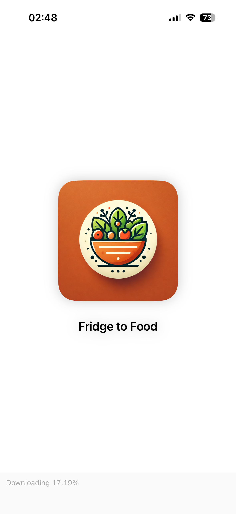
  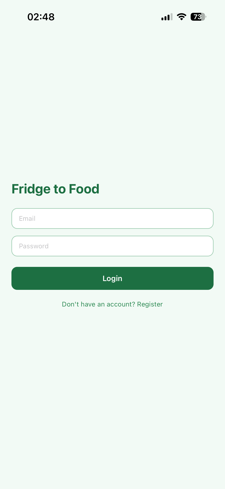
  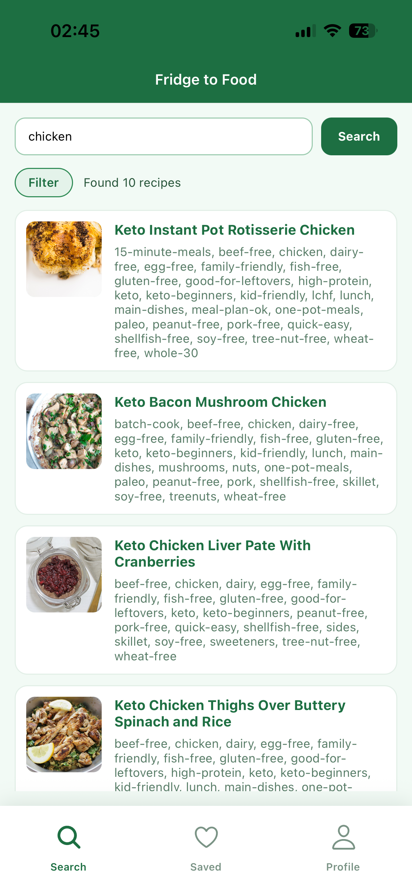
  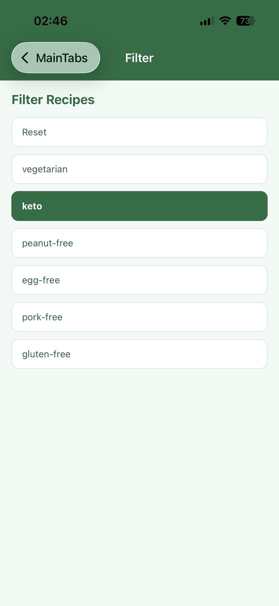
</p>
<p>
  
  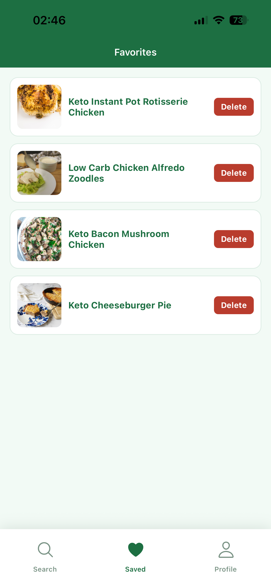
  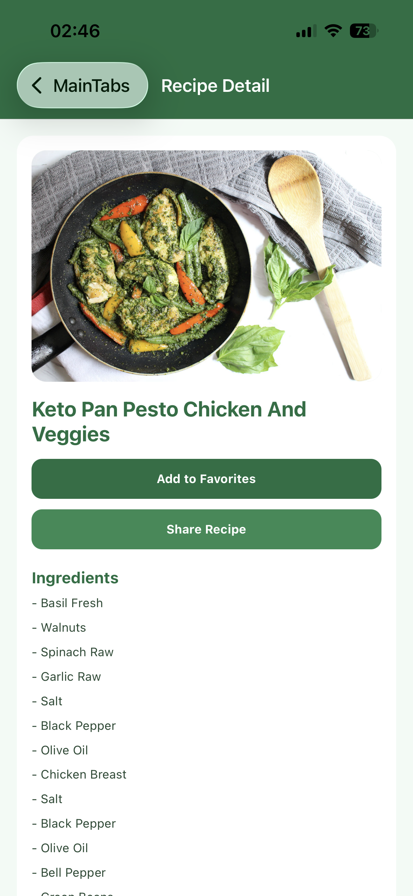
  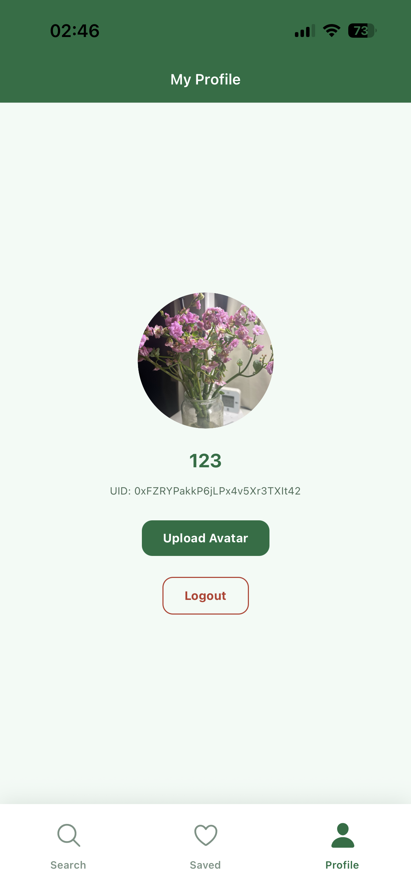
</p>


### Android demo video: `images/android_demo.mp4`

<video src="images/android_demo.mp4" controls width="320"></video>


### Android Screenshots
<p>
  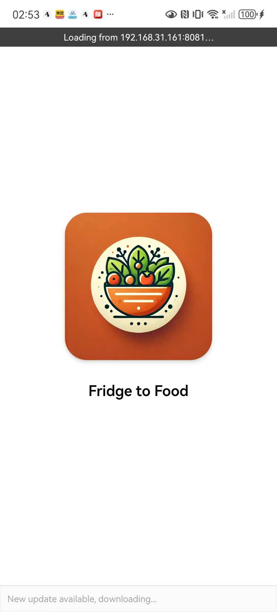
  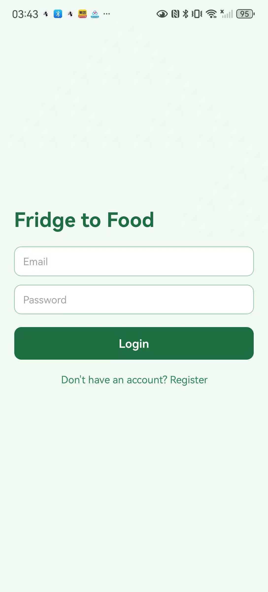
  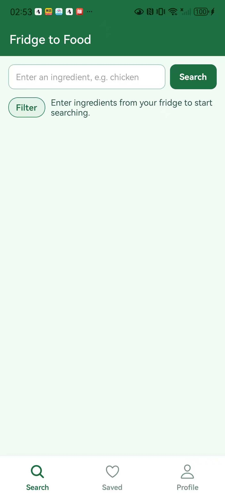
  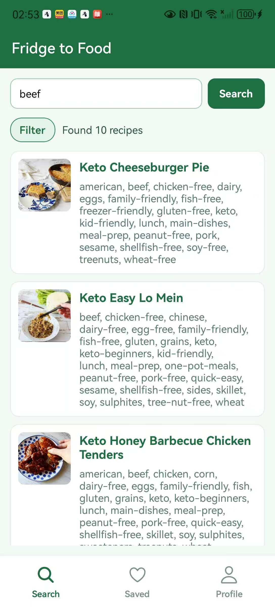
</p>
<p>
  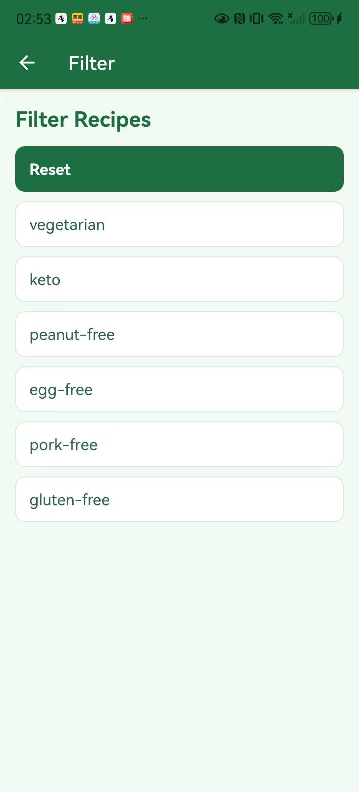
  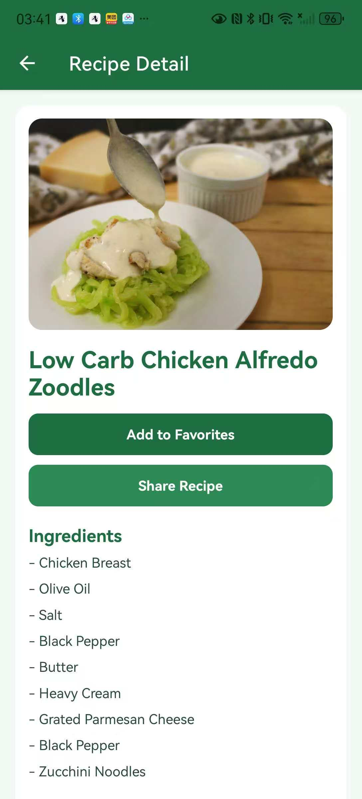
  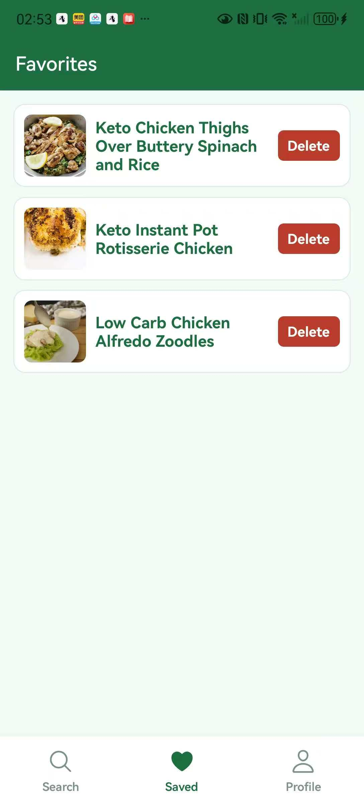
  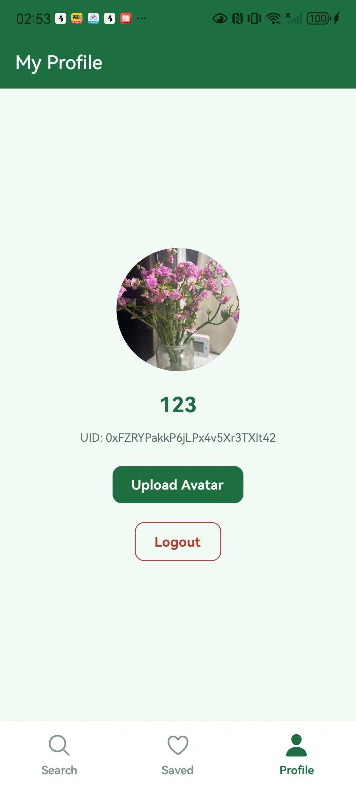
</p>

